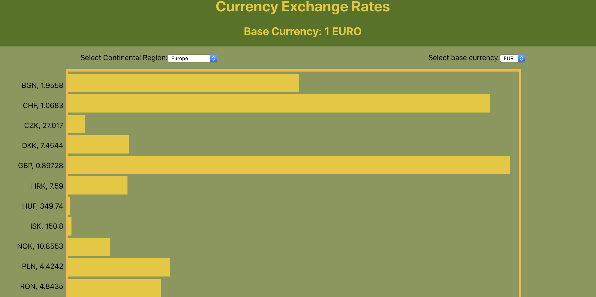

# Exchange Rate Data

## What it's about
This widget allows a user to check exchange rates of various countries in comparison to the EURO, USD, GBP, CAD and AUD. 

## Data Package
* The data is fetched from an API, [Foreign Exchange Rates](exchangeratesapi.io).

* Current data displayed is calculated from [Latest Exchange Rates](https://api.exchangeratesapi.io/latest) with the specified base currency queried.

## Data Visualization Scheme

The data is displayed with a bar chart, allowing the user to select specific continental regions and base currencies to sort the data. The chart plots the bars in relation to the strength of the base currency.

### Demo

